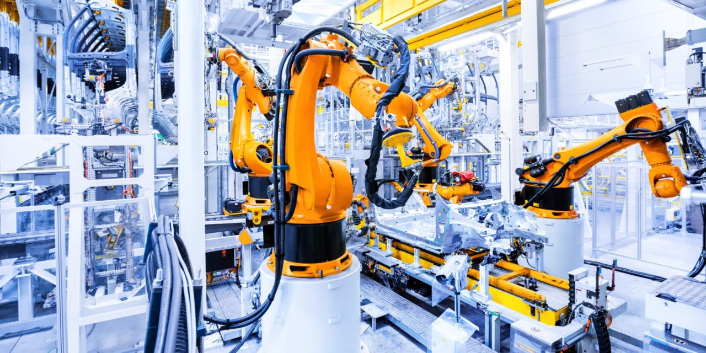

Industrial robotics integrates advanced technologies and engineering to automate manufacturing processes. This guide will help you get started on your journey into the exciting world of industrial robotics.

## Understanding Industrial Robotics

### Definition
Industrial robotics involves the use of robots in manufacturing environments to perform tasks such as assembly, welding, painting, inspection, and material handling. These robots are designed to enhance productivity, precision, and safety in industrial settings.

### Components of Industrial Robots
- **Manipulator:** The arm of the robot that performs tasks.
- **End-Effector:** The tool attached to the manipulator for specific tasks (e.g., grippers, welding torches).
- **Controller:** The brain of the robot, which controls its movements and functions.
- **Sensors:** Devices that provide feedback to the controller for better accuracy and adaptability.
- **Drive System:** The motors and actuators that move the robot.

## Types of Industrial Robots

### 1. Articulated Robots

**Description:**
Articulated robots have rotary joints and can range from simple two-joint structures to complex ten-joint structures. These robots mimic the movements of a human arm, providing high flexibility and a wide range of motion.

**Applications:**
- **Welding:** Articulated robots are widely used in automotive manufacturing for spot and arc welding.
- **Assembly:** They are used in assembling products ranging from electronics to automotive components.
- **Material Handling:** Moving items from one location to another within a factory.

**Advantages:**
- High versatility and adaptability.
- Can reach around obstacles and perform complex tasks.
- Suitable for a wide range of applications.

**Disadvantages:**
- More complex control systems.
- Higher cost compared to simpler robots.

<iframe width="960" height="540" src="https://www.youtube.com/embed/wNY01XEi_nI?si=AkApZ5xgMdCFNAQ2" title="YouTube video player" frameborder="0" allow="accelerometer; autoplay; clipboard-write; encrypted-media; gyroscope; picture-in-picture; web-share" referrerpolicy="strict-origin-when-cross-origin" allowfullscreen></iframe>

### 2. SCARA Robots (Selective Compliance Articulated Robot Arm)

**Description:**
SCARA robots have a cylindrical work envelope and are known for their speed and precision. They have two parallel rotary joints to provide compliance in a plane.

**Applications:**
- **Pick-and-Place Tasks:** Rapidly moving parts from one location to another.
- **Assembly:** Particularly in electronics manufacturing for tasks like inserting components.
- **Packaging:** Packing products into containers or arranging them for shipment.

**Advantages:**
- High speed and precision.
- Excellent for vertical assembly operations.
- Simple design and control.

**Disadvantages:**
- Limited to planar (2D) movements.
- Not suitable for tasks requiring 3D flexibility.

<iframe width="960" height="540" src="https://www.youtube.com/embed/-m1oKuFkSTE?si=CwO6pvWSQ2ioiHds&amp;start=16" title="YouTube video player" frameborder="0" allow="accelerometer; autoplay; clipboard-write; encrypted-media; gyroscope; picture-in-picture; web-share" referrerpolicy="strict-origin-when-cross-origin" allowfullscreen></iframe>

### 3. Delta Robots

**Description:**
Delta robots, also known as parallel robots, consist of three arms connected to universal joints at the base. They are known for their high speed and precision in a small, lightweight structure.

**Applications:**
- **Food Processing:** Sorting and packaging food items.
- **Pharmaceuticals:** Handling and packaging of medical products.
- **Electronics Assembly:** Placing small components on circuit boards.

**Advantages:**
- Extremely fast and precise.
- Lightweight and compact design.
- Ideal for high-speed pick-and-place tasks.

**Disadvantages:**
- Limited payload capacity.
- Complex kinematics and control systems.

<iframe width="960" height="540" src="https://www.youtube.com/embed/qN9fWwwse1Q?si=KIkMWeWJcCB80j32&amp;start=6" title="YouTube video player" frameborder="0" allow="accelerometer; autoplay; clipboard-write; encrypted-media; gyroscope; picture-in-picture; web-share" referrerpolicy="strict-origin-when-cross-origin" allowfullscreen></iframe>

### 4. Cartesian Robots

**Description:**
Cartesian robots, also known as gantry robots, operate on three linear axes (X, Y, and Z) to perform movements. They are known for their straightforward design and ease of programming.

**Applications:**
- **CNC Machining:** Performing precise cutting and milling operations.
- **3D Printing:** Building objects layer by layer in additive manufacturing.
- **Automated Storage and Retrieval:** Moving items within warehouses or storage systems.

**Advantages:**
- Simple and rigid structure.
- High positional accuracy.
- Easy to program and integrate into existing systems.

**Disadvantages:**
- Limited to linear movements.
- Requires significant space for the linear axes.

<iframe width="960" height="540" src="https://www.youtube.com/embed/BuV_ikbM1Vc?si=3wUisBbiF8B9AmiK" title="YouTube video player" frameborder="0" allow="accelerometer; autoplay; clipboard-write; encrypted-media; gyroscope; picture-in-picture; web-share" referrerpolicy="strict-origin-when-cross-origin" allowfullscreen></iframe>

### 5. Collaborative Robots (Cobots)

**Description:**
Collaborative robots, or cobots, are designed to work alongside humans in a shared workspace. They are equipped with advanced sensors and safety features to ensure safe interaction with human workers.

**Applications:**
- **Assembly:** Working alongside humans to perform repetitive tasks.
- **Material Handling:** Assisting in lifting and moving heavy objects.
- **Quality Inspection:** Collaborating with humans to inspect products for defects.

**Advantages:**
- Enhanced safety features for human-robot collaboration.
- Easy to program and reconfigure.
- Can work in close proximity to humans without extensive safety barriers.

**Disadvantages:**
- Lower speed and payload capacity compared to traditional industrial robots.
- Higher cost due to advanced safety and sensing technologies.

<iframe width="960" height="540" src="https://www.youtube.com/embed/oXQxM8fE3c0?si=xT8Z88qe-Xi-rTrJ&amp;start=8" title="YouTube video player" frameborder="0" allow="accelerometer; autoplay; clipboard-write; encrypted-media; gyroscope; picture-in-picture; web-share" referrerpolicy="strict-origin-when-cross-origin" allowfullscreen></iframe>

### 6. Cylindrical Robots

**Description:**
Cylindrical robots operate within a cylindrical coordinate system. They have a rotary joint at the base and a linear joint to extend and retract along an axis.

**Applications:**
- **Welding:** Used in applications where a cylindrical work envelope is advantageous.
- **Material Handling:** Loading and unloading machines in manufacturing processes.
- **Assembly:** Performing tasks that require reaching into confined spaces.

**Advantages:**
- Simple and compact design.
- Good reach and flexibility within a cylindrical work envelope.
- Suitable for tasks requiring vertical and rotational movements.

**Disadvantages:**
- Limited to cylindrical work areas.
- Less versatile compared to articulated robots.

<iframe width="960" height="540" src="https://www.youtube.com/embed/Hj7PxjeH5y0?si=NDbjhxXLEcYktkrZ" title="YouTube video player" frameborder="0" allow="accelerometer; autoplay; clipboard-write; encrypted-media; gyroscope; picture-in-picture; web-share" referrerpolicy="strict-origin-when-cross-origin" allowfullscreen></iframe>

### 7. Spherical Robots

**Description:**
Spherical robots, also known as polar robots, have a work envelope that resembles a sphere. They typically have a rotary base and a combination of linear and rotary joints.

**Applications:**
- **Painting:** Applying coatings and paints to complex surfaces.
- **Welding:** Performing welding tasks that require reaching around obstacles.
- **Material Handling:** Moving items within a spherical workspace.

**Advantages:**
- Wide range of motion.
- Suitable for tasks requiring a spherical work area.
- Can reach around obstacles effectively.

**Disadvantages:**
- Complex kinematics and control systems.
- Less commonly used compared to other types of robots.

<iframe width="960" height="540" src="https://www.youtube.com/embed/HYCdjd-0Gy8?si=WiaIndMW733N43xI&amp;start=10" title="YouTube video player" frameborder="0" allow="accelerometer; autoplay; clipboard-write; encrypted-media; gyroscope; picture-in-picture; web-share" referrerpolicy="strict-origin-when-cross-origin" allowfullscreen></iframe>

### 8. Mobile Robots

**Description:**
Mobile robots are not fixed in one location and can move throughout a facility. They can be guided by various technologies such as GPS, LiDAR, or vision systems.

**Applications:**
- **Automated Guided Vehicles (AGVs):** Transporting materials within a warehouse or factory.
- **Inspection:** Inspecting infrastructure such as pipelines or buildings.
- **Service Robotics:** Delivering goods or performing tasks in various environments.

**Advantages:**
- High flexibility and mobility.
- Can perform tasks in large and dynamic environments.
- Suitable for logistics and material handling.

**Disadvantages:**
- Requires advanced navigation and control systems.
- Potentially higher cost due to mobility components.

<iframe width="960" height="540" src="https://www.youtube.com/embed/xL8deJDusns?si=rfTqCZ6w43tSHR4q" title="YouTube video player" frameborder="0" allow="accelerometer; autoplay; clipboard-write; encrypted-media; gyroscope; picture-in-picture; web-share" referrerpolicy="strict-origin-when-cross-origin" allowfullscreen></iframe>

Each type of industrial robot has its own strengths and limitations, making them suitable for specific applications. Understanding these characteristics will help you choose the right robot for your needs.

## Essential Skills and Knowledge

1. **Basic Robotics Concepts:**
   - **Kinematics and Dynamics:** Understanding the motion and forces involved in robot movements.
   - **Control Systems:** Knowledge of how robots are controlled and programmed.
   - **Programming Languages:** Familiarity with languages like Python, C++, and specialized robotics languages such as ROS (Robot Operating System).

2. **Electronics and Electrical Engineering:**
   - **Circuit Design:** Understanding how to design and troubleshoot electronic circuits.
   - **Sensors and Actuators:** Knowledge of different types of sensors and how they integrate with robotic systems.

3. **Mechanical Engineering:**
   - **Mechanisms and Linkages:** Understanding the mechanical design of robotic arms and joints.
   - **Materials Science:** Knowledge of materials used in robot construction.

4. **Computer Science:**
   - **Algorithms:** Understanding algorithms for path planning, object recognition, and machine learning.
   - **Software Development:** Ability to develop and debug software for robotic applications.

## Learning Resources

### Online Courses and Tutorials:
- **Coursera and edX:** Platforms offering courses from universities like MIT and Stanford.
- **Udacity:** Robotics Nanodegree programs.
- **YouTube Channels:** Channels like ROBOTICS and Tech With Tim provide practical tutorials.

### Books
- *"Introduction to Robotics: Mechanics and Control" by John J. Craig*
- *"Robotics: Modelling, Planning and Control" by Bruno Siciliano, Lorenzo Sciavicco, Luigi Villani, and Giuseppe Oriolo*

### Websites and Forums
- [ROS.org](https://www.ros.org): For resources and community support on Robot Operating System.
- [RobotShop Community](https://www.robotshop.com/community/): Forums and blogs for robotics enthusiasts.
- [Stack Overflow](https://stackoverflow.com/): For troubleshooting and programming help.

## Hands-On Experience

1. **Robotics Kits:**
   - **LEGO Mindstorms:** Great for beginners to learn the basics of robotics.
   - **Arduino and Raspberry Pi:** For more advanced projects involving custom hardware and software.

2. **Simulation Software:**
   - **Gazebo:** For simulating complex robotic environments.
   - **V-REP (CoppeliaSim):** For creating and testing robotic models.

3. **Internships and Projects:**
   - **Join Robotics Clubs or Competitions:** Engage with community projects or competitions like FIRST Robotics.
   - **Industry Internships:** Gain practical experience by working with companies specializing in robotics.

## Future Trends in Industrial Robotics

- **AI and Machine Learning:** Integrating AI for smarter and more autonomous robots.
- **IoT and Connectivity:** Enhanced connectivity for better monitoring and control of robotic systems.
- **Advanced Materials:** Development of lightweight and durable materials for better performance.
- **Human-Robot Collaboration:** Improving safety and efficiency in environments where robots and humans work together.

## Conclusion

Getting started in industrial robotics requires a blend of theoretical knowledge and practical experience. By understanding the basics, learning from various resources, and engaging in hands-on projects, you can build a strong foundation in this dynamic and evolving field. The future of industrial robotics is bright, offering numerous opportunities for innovation and career growth.