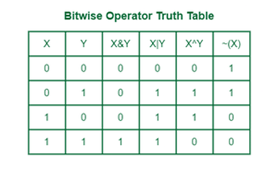
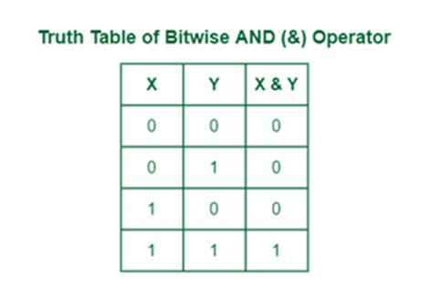
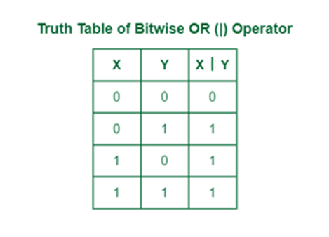
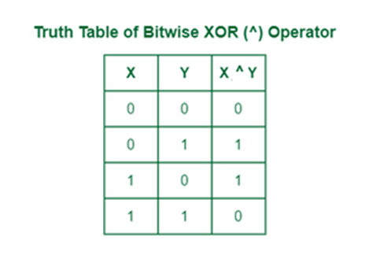
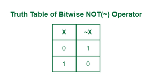
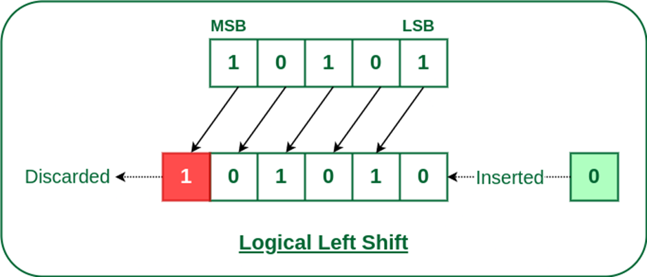
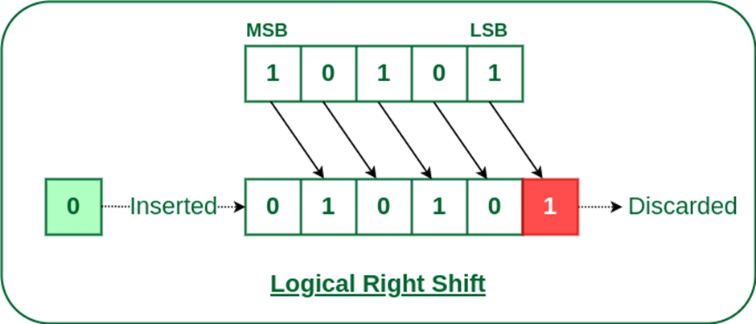

# Introduction to Bitwise Algorithms – Data Structures and Algorithms Tutorial

Bit stands for binary digit. A bit is the basic unit of information and can only have one of two possible values: 0 or 1. In our world, we usually work with numbers using the decimal base, i.e., the digits 0 to 9. However, there are other number representations that can be quite useful, such as the binary number system.

Unlike humans, computers have no concept of words and numbers as we do. They receive data encoded at the lowest level as a series of zeros and ones (0 and 1). These are called bits, and they are the basis for all the commands computers receive. We’ll begin by learning about bits and then explore a few algorithms for manipulating them. This tutorial is meant to be an introduction to bitwise algorithms for programmers.

## What are Bitwise Algorithms?

Bitwise algorithms refer to algorithms that perform operations on individual bits or bit patterns within computer data. These algorithms use the binary representation of data and fundamental bitwise operations such as AND, OR, XOR, NOT, and bit shifting to manipulate and extract information from the data.

Bitwise algorithms are usually faster and use less memory than regular arithmetic operations because they work directly with the binary representation of data. This often leads to faster execution times and reduced memory usage.

## Bitwise Operators / Basics of Bit Manipulation

An algorithmic operation known as bit manipulation involves the manipulation of bits at the bit level (bitwise). Bit manipulation is all about these bitwise operations. They improve the efficiency of programs by being primitive, fast actions. The computer uses bit manipulation to perform operations like addition, subtraction, multiplication, and division at the bit level. These operations are performed in the arithmetic logic unit (ALU), which is a part of a computer’s CPU. Inside the ALU, all such mathematical operations are performed.

There are different bitwise operations used in bit manipulation. These operations operate on the individual bits of the bit patterns. Bit operations are fast and can be used in optimizing time complexity.

The main bitwise operators are:

- **AND** (`&`)
- **OR** (`|`)
- **XOR** (`^`)
- **NOT** (`~`)
- **Left Shift** (`<<`)
- **Right Shift** (`>>`)



### Bitwise AND Operator (`&`)

The bitwise AND operator is denoted using a single ampersand symbol, `&`. The `&` operator takes two equal-length bit patterns as parameters. The two-bit integers are compared. If the bits in the compared positions of the bit patterns are 1, then the resulting bit is 1. If not, it is 0.

**Truth Table of AND Operator:**

| A | B | A & B |
|---|---|-------|
| 0 | 0 |   0   |
| 0 | 1 |   0   |
| 1 | 0 |   0   |
| 1 | 1 |   1   |





**Example:**

Take two bit values X and Y, where X = 7 (111<sub>2</sub>) and Y = 4 (100<sub>2</sub>). The bitwise AND of X and Y is:

```
  111
& 100
------
  100 (which is 4 in decimal)
```

### Bitwise OR Operator (`|`)

The `|` operator takes two equivalent-length bit designs as boundaries; if the two bits in the compared position are 0, the resulting bit is 0. If not, it is 1.

**Truth Table of OR Operator:**

| A | B | A \| B |
|---|---|-------|
| 0 | 0 |   0   |
| 0 | 1 |   1   |
| 1 | 0 |   1   |
| 1 | 1 |   1   |



**Example:**

Take two bit values X and Y, where X = 7 (111<sub>2</sub>) and Y = 4 (100<sub>2</sub>). The bitwise OR of X and Y is:

```
  111
| 100
------
  111 (which is 7 in decimal)
```

### Bitwise XOR Operator (`^`)

The `^` operator (also known as the XOR operator) stands for Exclusive OR. Here, if bits in the compared position do not match, the resulting bit is 1. The result of the bitwise XOR operator is 1 if the corresponding bits of two operands are opposite, otherwise 0.

**Truth Table of XOR Operator:**

| A | B | A ^ B |
|---|---|-------|
| 0 | 0 |   0   |
| 0 | 1 |   1   |
| 1 | 0 |   1   |
| 1 | 1 |   0   |




**Example:**

Take two bit values X and Y, where X = 7 (111<sub>2</sub>) and Y = 4 (100<sub>2</sub>). The bitwise XOR of X and Y is:

```
  111
^ 100
------
  011 (which is 3 in decimal)
```

### Bitwise NOT Operator (`~`)

The bitwise NOT operator is a unary operator, denoted by the tilde symbol `~`. It inverts the bits of its operand, converting 0s to 1s and 1s to 0s.



**Example:**

For a bit value X = 7 (0000 0111<sub>2</sub>) in an 8-bit system, the bitwise NOT of X is:

```
~ 0000 0111
  1111 1000 (which is -8 in two's complement representation)
```

### Left Shift (`<<`)

The left shift operator is denoted by the double left arrow symbol `<<`. The general syntax for left shift is `shift-expression << k`. The left-shift operator causes the bits in the shift expression to be shifted to the left by the number of positions specified by `k`. The bit positions that the shift operation has vacated are zero-filled.

**Note:** Every time we shift a number to the left by 1 bit, it multiplies that number by 2.




**Example:**

Input: Left shift of 5 by 1

```
Binary representation of 5:   00101
Left shift by 1:             01010 (which is 10 in decimal)
```

### Right Shift (`>>`)

The right shift operator is denoted by the double right arrow symbol `>>`. The general syntax for the right shift is `shift-expression >> k`. The right-shift operator causes the bits in the shift expression to be shifted to the right by the number of positions specified by `k`. For unsigned numbers, the bit positions that the shift operation has vacated are zero-filled. For signed numbers, the sign bit is used to fill the vacated bit positions. In other words, if the number is positive, 0 is used; if the number is negative, 1 is used.

**Note:** Every time we shift a number to the right by 1 bit, it divides that number by 2.



**Example:**

Input: Right shift of 5 by 1

```
Binary representation of 5:  00101
Right shift by 1:            00010 (which is 2 in decimal)
```

## Application of Bit Operators

- **Optimization of Embedded Systems:** Bit operations are used to enhance the performance of embedded systems.
- **Data Integrity Verification:** The Exclusive OR operator can be used to confirm the integrity of a file, ensuring it has not been corrupted, especially after it has been in transit.
- **Data Encryption and Compression:** Bitwise operations are widely used in data encryption and compression techniques.
- **Networking:** Bits are used in networking to frame packets of numerous bits, which are sent to another system generally through any type of serial interface.
- **Digital Image Processing:** Digital image processors use bitwise operations to enhance image pixels and to extract different sections of a microscopic image.

This introduction to bitwise algorithms and operators provides a foundation for understanding and utilizing these powerful tools in programming. The efficiency and low-level control they offer make them essential for various applications in computing.
